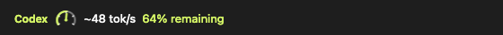
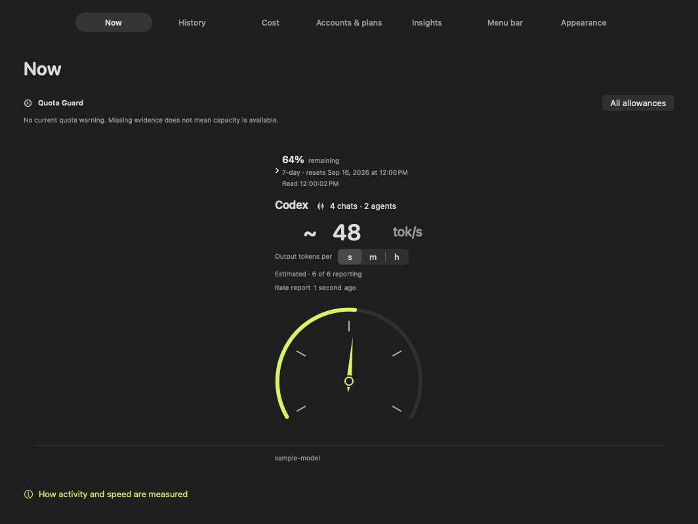

# Token Bar

See your AI usage from the macOS menu bar.

**Menu bar**



**Dashboard**



*Native Token Bar previews with synthetic sample data.*

Token Bar brings together local activity, estimated output speed, account
allowance and usage history for Codex, Claude Code, Grok and OpenCode. It keeps
saved measurements on your Mac and updates them as new records arrive.

**v0.1.5 · Apple silicon · macOS 14+ · Swift/SwiftUI · MIT**

[Website](https://token-bar-9v8.pages.dev) · [Releases](https://github.com/rogu3bear/token-bar/releases) · [Changelog](CHANGELOG.md) · [Contributing](CONTRIBUTING.md)

## At a glance

- **See what is working.** Active tools appear in the menu bar and dashboard,
  with estimated output rates labeled in tok/s, tok/m or tok/h.
- **Keep account allowance in view.** Supported account readings show remaining
  quota, reset times and an estimated time to exhaustion when enough observations exist.
- **Explore saved history.** Filter by tool, task, model, project, account or day;
  export the matching records to CSV.
- **Pick up where you left off.** Collected data persists between launches.
  Incremental reads and cached reports avoid reprocessing unchanged history when
  you switch pages.
- **Make it yours.** Choose menu-bar fields, their order, rate units, appearance
  and accent color.

Quota Guard adds one allowance warning in Now and the
popover, even when no tool is active. Its optional menu-bar warning field and
notifications are off by default. Menu bar settings controls the low threshold,
forecast lead and sound. Warnings identify one account allowance; they do not
mean an entire tool has stopped.

## Get started

[Download Token Bar 0.1.5 for Mac (.pkg)](https://github.com/rogu3bear/token-bar/releases/download/v0.1.5/TokenBar-0.1.5-arm64.pkg)

The installer is signed with Developer ID and notarized by Apple. Open the
`.pkg` and follow the macOS installer; it installs **Token Bar.app** in
`/Applications`. Then open Token Bar from Applications. No build tools or reboot
are required. Requires Apple silicon and macOS 14 or later.

[Release notes and checksum](https://github.com/rogu3bear/token-bar/releases/tag/v0.1.5)

GitHub Releases hosts the direct macOS installer. A separate GitHub Packages
OCI artifact, `ghcr.io/rogu3bear/token-bar:0.1.0`, contains the initial 0.1.0
installer, its checksum and a short README. The current 0.1.5 installer is
available through GitHub Releases. The OCI artifact is a distribution archive,
not a runnable container. Its listing remains private as of September 13, 2026; use the public
Release download above. [Distribution and verification details](docs/RELEASING.md).

On first launch, review the local-data explanation and choose **Start local
monitoring**. Token Bar discovers supported tools in their standard locations.
For Codex account allowance, use an existing local Codex installation and sign
in there. API-key-only accounts may not supply subscription quota.

Only one copy can use the local usage store at a time. Quit an existing copy
before opening a development build. Launch at login is optional.

To build your own installer, run `./scripts/package.sh` after following the
build steps below. Local development packages are not notarized. See
[the release guide](docs/RELEASING.md) for signing and verification.

## Supported readings

| Tool | Usage history | Estimated output speed | Account allowance |
| --- | --- | --- | --- |
| Codex | Yes | Yes | Supported signed-in accounts |
| Claude Code | Yes | Yes | Account-matched usage cache, refreshed by installed Claude Code every 15 minutes |
| Grok | Yes | When live session counters are available | Installed agent's billing reading |
| OpenCode | Yes | Unavailable | Unavailable |

Each reading depends on what the installed tool exposes. Missing, stale and
unsupported values remain unavailable. Token Bar asks the installed Claude Code
to refresh its account usage every 15 minutes; between refreshes, readings show
their age. The optional Claude status-line connection does not supply
account-bound quota. The optional **Fable quota** menu-bar field shows the lowest
remaining of Claude's 5-hour, weekly and Fable weekly limits and names the limit
that binds; it is unavailable when any of them is missing or stale. An optional,
smaller **time left** field projects when the first of those limits runs out at
the average burn of recent hours, weighted toward recent use. It needs 30 minutes
of readings after launch or a reset, and says so while it learns.

Speed is estimated from token-counter changes over time. Token totals are
input plus output; cached input and reasoning are already included in those
categories. Repeated snapshots and inherited fork counters are deduplicated.

Account allowance is separate from token totals. API-equivalent cost compares
supported usage against dated OpenAI API prices; it is not your subscription
bill. Other providers remain unpriced. Cost also compares full request cost per
million output tokens over time and by model, with matched priced records and
explicit output coverage. Output volume includes reasoning and does not establish
answer quality. The account comparison provides context beyond available local
records without claiming to identify another host. See [cost semantics](docs/COST.md).

## Your data

Usage history lives in `~/Library/Application Support/CodexTokenBar/`. The
legacy path and bundle identity preserve existing history and preferences.
Records can include account labels, project paths, task identities and token
counts. CSV exports can include those labels and paths.

Saved usage is loaded before scanning. File cursors and identities persist, so
reopening the app checks for changes without replaying unchanged transcripts.
History and Cost reuse in-memory report results during the app session; those
reports are prepared in the background from saved usage after relaunch, using a
durable date/context index. Insights saves derived statistics and per-chat byte
checkpoints, then processes only appended content in changed chats. Cached
statistics appear before its lazy refresh. Prompt text is not persisted.
Usage saves can lag newly displayed records by up to 15 seconds; normal quit
flushes pending work. See [storage and recovery](ARCHITECTURE.md#log-to-ledger).

Token Bar does not upload usage history or include telemetry. Prompt insights
read local Codex text in memory; prompt text is not copied into the usage ledger.
Installed provider tools may contact their services to read account allowance.
Token Bar does not ask you for passwords or API keys.

Feedback is voluntary. The [feedback form](https://token-bar-9v8.pages.dev/feedback/)
saves a draft in your browser. Review on GitHub sends its fields to GitHub in a
URL; you separately choose whether to submit a public issue there. A GitHub
account is required. The site collects no email and never posts automatically.
Read the [privacy details](https://token-bar-9v8.pages.dev/privacy/).

## Build from source

Install Xcode command-line tools and Bun 1.3 or later. You only need these tools
for development; the published installer is ready to install.

```sh
git clone https://github.com/rogu3bear/token-bar.git
cd token-bar
./scripts/build.sh
open "build/Token Bar.app"
```

Run the local checks before contributing:

```sh
./scripts/test.sh
(cd site && bun install && bun test && bun run build)
python3 Tests/PublicTree/main.py
python3 scripts/check-public-tree.py
```

The native app uses Swift/SwiftUI without third-party Swift packages. The
website lives under `site/` in this repository and uses static HTML, CSS and
JavaScript with local GitHub report drafting. JavaScript tooling is Bun-managed;
verification runs locally, without GitHub Actions.

- `Sources/` and `Tests/`: app implementation and synthetic regression fixtures.
- `Assets/`: native app resources.
- `scripts/`: build, installer, preview and verification commands.
- `site/`: product website and local report drafting.
- `docs/` and [ARCHITECTURE.md](ARCHITECTURE.md): technical guides.

Documentation: [Architecture](ARCHITECTURE.md), [Design](docs/DESIGN.md),
[Cost](docs/COST.md), [Releasing](docs/RELEASING.md), [Deployment](docs/DEPLOYMENT.md),
[Contributing](CONTRIBUTING.md), [Security](SECURITY.md) and
[Code of conduct](CODE_OF_CONDUCT.md).

Local agent instructions, diagnostic records, credentials, usage databases and
build outputs are ignored and excluded from the public tree. The public-tree
check inspects staged files; ignore rules alone cannot remove tracked content.

Token Bar is an independent project, unaffiliated with AI providers.
Contributions are welcome under the [MIT license](LICENSE).
